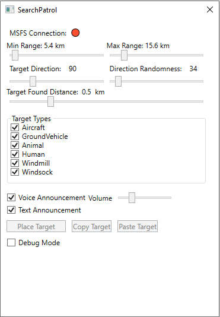

# About 

SearchPatrol is an addon for Microsoft Flight Simulator
that will place objects at random locations in the world and 
guide you to the general location, where you have to search for it visually.
After you find it, do a "wing wave", tipping the wings back and forth a few times, and a new target will be placed.

# Tips
- Difficulty can vary *greatly* with where you are flying and the chosen target types
- Windmills are easy mode, they are easily visible from very far away
- Wilderness is ideal, the fewer trees the easier it will be
- If you're flying in a city and the target is a person it's basically going to be impossible

# Options
- Min & Max Range: the target will be placed somewhere between these 2 distances away from you
- Target Direction & Direction Randomness: the direction is the heading from you to where the target gets placed, 
  plus/minus the randomness. If you want the target to be in any possible direction set randomness to 360.
- Target Found Distance: how close you have to be to the target when you do a wing wave for it to count as found
- Target Types: the target type will a random one of the selected types
- Voice Announcement: target info will be spoken using Windows' text-to-speech
- Text Announcement: target info will be shown in the game UI

# How to run

Download and run the setup. Run it before or after you run MSFS, it will automatically connect. 
Once you're flying in the area you want to search press **Place Target** to get started.
